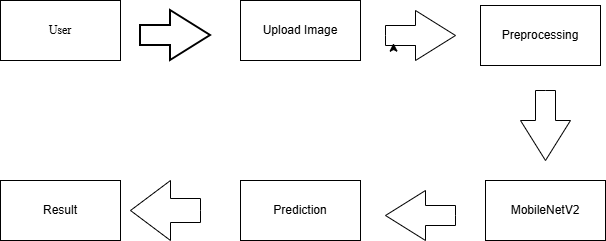

# 🌿 PlantCare AI: Advanced Plant Disease Detection Using Transfer Learning

## 📌 Project Overview
The AI-Based Plant Disease Detection System is a deep learning project that detects diseases from images using Transfer Learning. The system takes an image as input, processes it, and predicts the disease category using a trained Convolutional Neural Network (CNN) model.

This project aims to help users detect diseases quickly and accurately using artificial intelligence.

---

## 🎯 Problem Statement
Manual disease detection can be time-consuming and inaccurate. Early detection is important to prevent serious damage. This system uses AI to automate disease detection from images.

---

## 🚀 Objective 
- Build an image classification model using Transfer Learning.
- Detect disease categories from uploaded images.
- Deploy the model through a simple web interface.

---

## 🛠️ Tech Stack
- Python
- TensorFlow / Keras
- OpenCV
- NumPy
- Pandas
- Matplotlib
- Flask (for web app)
- Scikit-learn

---

## 🧠 Model Approach
We are using **Transfer Learning** with a pre-trained CNN model (e.g., MobileNet / ResNet) to improve accuracy and reduce training time.

Workflow:
1. Image Input
2. Image Preprocessing
3. Feature Extraction (Pre-trained CNN)
4. Classification Layer
5. Disease Prediction Output

---

## 📂 Project Structure
disease-detection/
│
├── data/
│ ├── raw/
│ ├── processed/
│
├── models/
│
├── notebooks/
│
├── src/
│ ├── data_preprocessing.py
│ ├── model_training.py
│ ├── predict.py
│
├── requirements.txt
├── README.md
└── .gitignore

---

## 📊 Dataset
The New Plant Diseases Dataset (Kaggle) is a comprehensive collection designed for plant pathology research and image-based disease classification.

● Total Images: 87,000+ augmented RGB images

● Image Format: JPEG

● Number of Classes: 38 (including healthy and diseased categories)

● Plant Types: Apple, Blueberry, Cherry, Corn, Grape, Orange, Peach, Pepper, Potato, Raspberry, Soybean, Squash, Strawberry, Tomato

● Image Size: 256×256 pixels (resized to 224×224 for MobileNetV2)

---

## Dataset Instructions

1. Download dataset from: [Dataset Link]
2. Place it inside:
   data/raw/
3. Run dataset_preprocessing.ipynb

---

## 📌 Future Enhancements
- Add real-time camera detection
- Improve model accuracy
- Add chatbot assistance
- Deploy on cloud platform

---

## 🔄 Project Workflow

1. User uploads plant leaf image
2. Image preprocessing (resize, normalize)
3. MobileNetV2 model prediction
4. Disease classification output
5. Display result with recommendations

---

## 📊 Workflow Diagram

---

## 📜 License
This project is for educational purposes.
